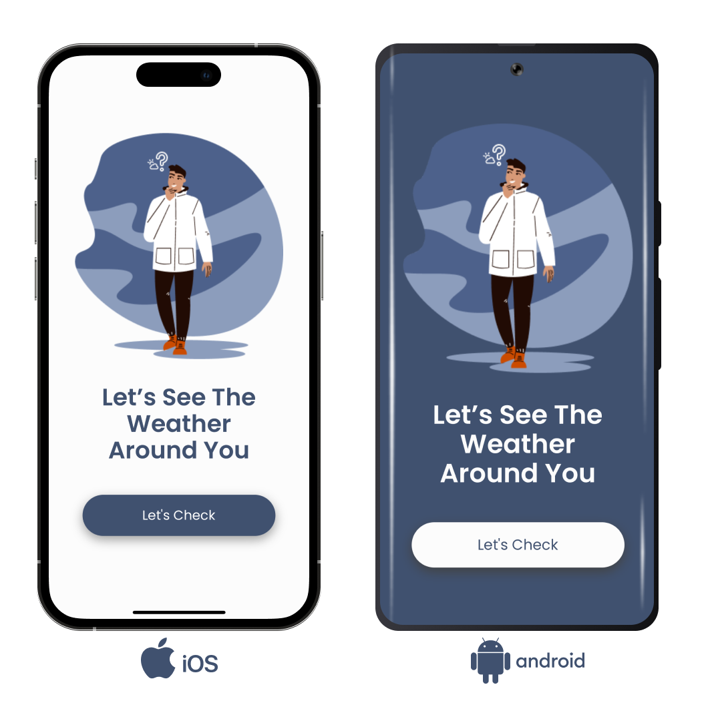
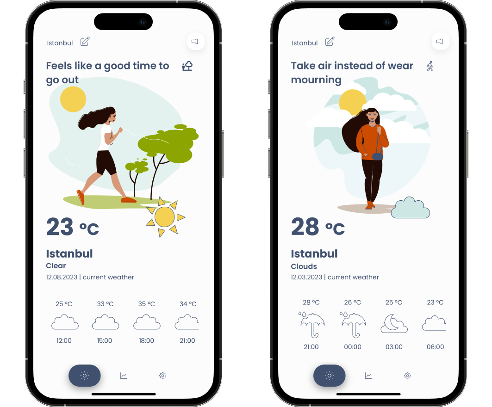
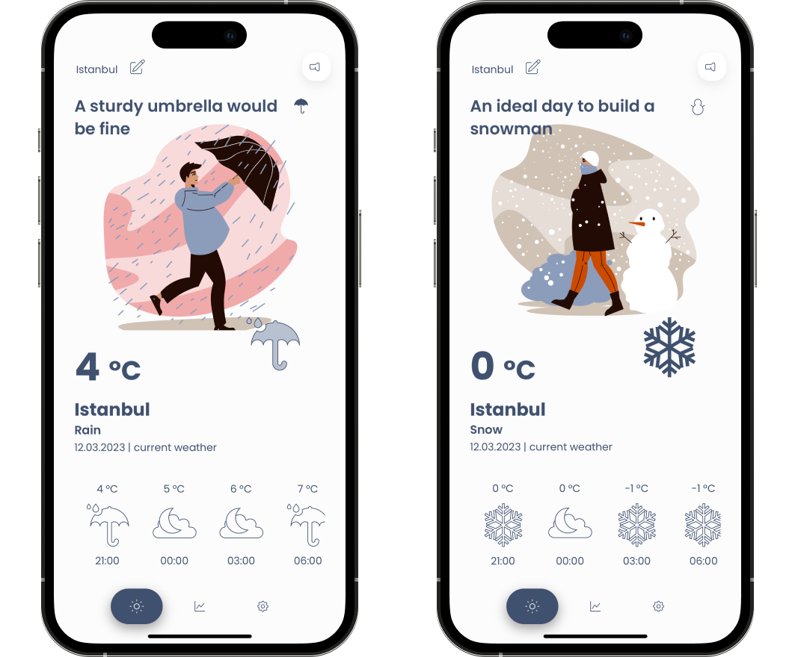
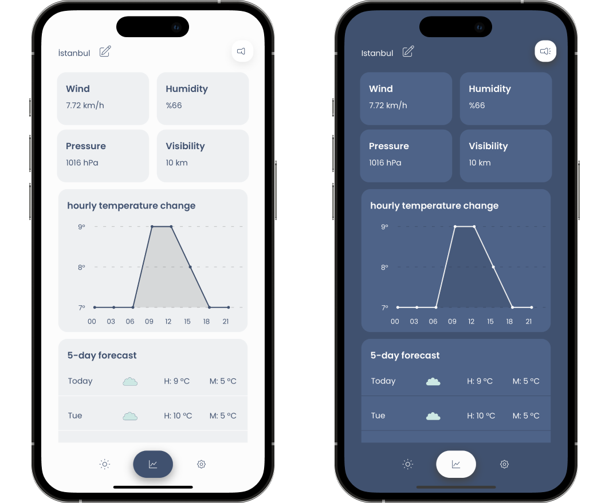
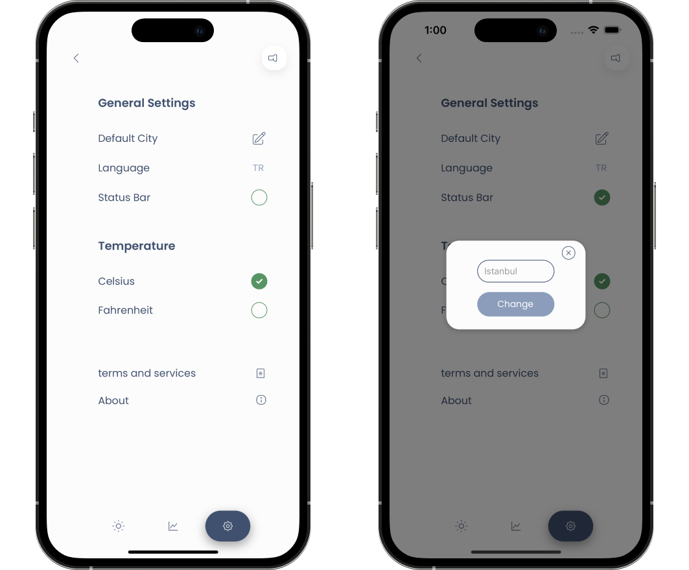
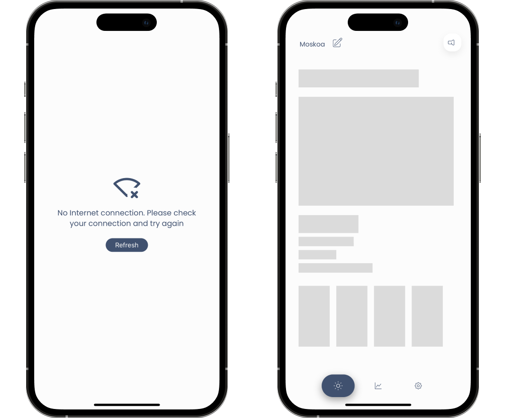

# Weather App

A cross-platform mobile application developed with React Native that displays weather information for a given city.

## Installation

To install and run the app on your local machine, follow these steps:

1. Clone the repository: `git clone https://github.com/vis-cognitionis/weather_app.git`
2. Install dependencies: `npm install`
3. Run the app on an emulator or device: `npm run android` or `npm run ios`

## Technologies 

  <li> <a href="https://reactnative.dev/">React Native</a></li> 
  <li> <a href="https://beta.reactjs.org/">React</a></li> 
  <li> <a href="https://www.typescriptlang.org/">TypeScript</a> </li> 
  <li> <a href="https://openweathermap.org/">OpenWeather API (Current Weather & 3-hour Forecast 5 days)</a> </li> 
  <li> <a href="https://reactnavigation.org/">React Navigation</a> </li> 
  <li> <a href="https://tanstack.com/query/latest">TanStack React Query</a> </li> 
  <li> <a href="https://mobx.js.org/">MobX</a> </li> 

## Project Structure

The project is organized into the following directories:

- `assets`: Contains static assets, such as images and fonts
- `src`: Contains the source code for the app
- `core`: Contains language, query and theme initial structures with reusable UI components and all icons in the app
- `images`:Contains background images for the app
- `navigation`:Contains components that allow pages within the app to be navigated
- `screens`: Contains the main screens for the app

## Dependencies

The app uses the following dependencies:

- `react`: A JavaScript library for building user interfaces
- `react-native`: A framework for building native apps using React
- `axios`: A library for making HTTP requests
- `react-navigation`: A library for managing navigation between screens
- `react-native-chart-kit`: A library used to create charts in React Native
- `react-native-restart`: A library used to restart a React Native app
- `mobx`: A library used for state management in JavaScript app
- `tanstack/react-query`: A library used for data management and sharing in React applications, providing many features for data management
- `react-native-svg`: A library used to create vector graphics such as icon in React Native

## Project Overview

This weather application was created with the idea of a simple, understandable, and clean interface design. The application starts with Istanbul as the default city without requiring any location data from the user. After the splash and landing screens, the home, detail, and settings screens are available. The home screen shows the current weather provided by the openWeather API along with 3-hourly weather information, using various images and icons along with humorous and advisory messages for the user. The entered city can be seen at the top and the theme switcher on the right can be set to either light or dark mode. On the detail screen, after the wind, pressure, and other information, the 3-hourly data is displayed in a chart and the temperature changes can be easily read. The lowest and highest temperature data is shown with 5-day forecast data underneath. In the settings section, users can change the default city, language (English or Turkish), status bar, and temperature unit settings. This way, they can use the application in the way they want without having to set their preferences again and again every time they reopen the app.

## Screenshots

Here are some example screenshots and video of the app:

  <video src="https://user-images.githubusercontent.com/108089138/225416202-14a1f6c0-1677-477e-a232-64ee628cfb9e.mp4" type="video/mp4"
  </video>
 

  
  <em>Video on general usage of the app</em>
   
   

  

  
   
  <em>Landing page of Weather App running on one iOS and one Android</em>

   
   

  
   
  <em>Clear and cloudy weather conditions from the Home screen</em>

   
   

  
   
  <em>Rainy and snowy weather conditions from Home screen</em>

   
   

  
   
  <em>Other information and chart on the Detail screen are available in two different themes as light and dark</em>

   
   

  
   
  <em>Settings screen overview and default city change modal screen</em>

   
   

  
   
  <em>Lazy loading screen with warning screen when there is no network connection</em>

## License
All software and libraries used in this project are either open source or used with permission, and the intellectual property rights to the source code and related materials belong solely to the creator of this project. This project is for informational purposes only and is not intended for commercial use.
